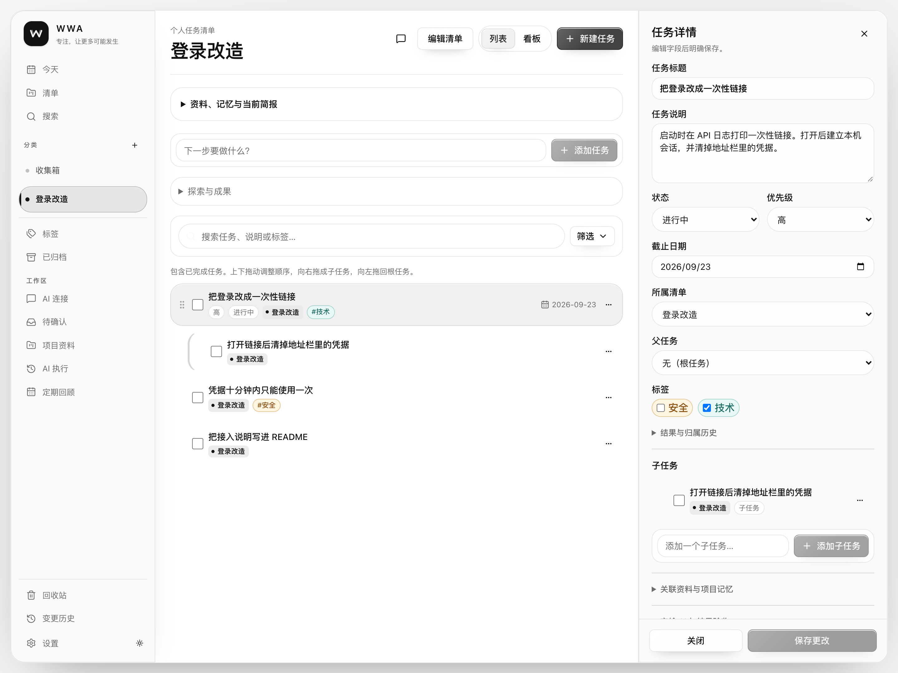
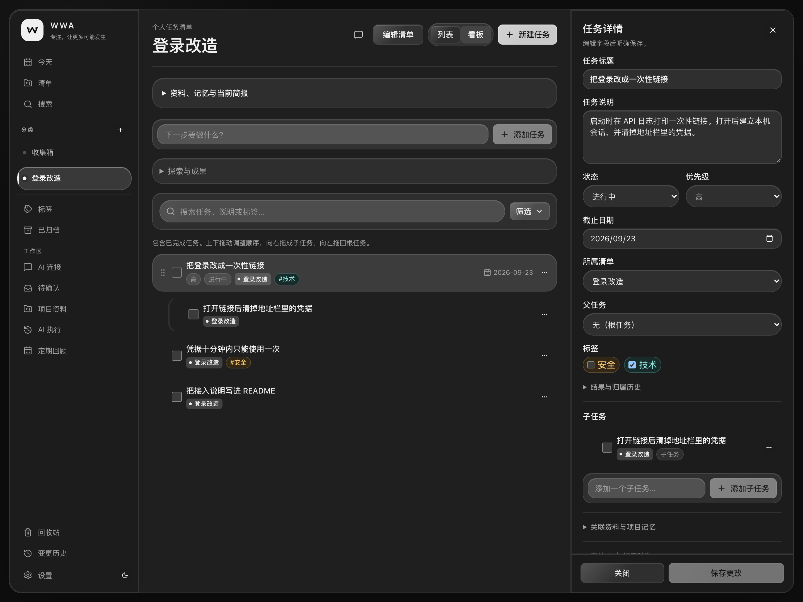
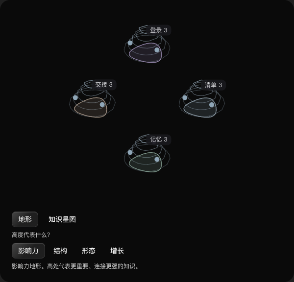

# Work With Agent


本机上的个人任务台。Codex、Claude Code 和 Grok 读取同一份待办和项目记忆，写入默认等你确认。

- **先记下来。** 收集箱、今天、清单、标签、子任务、手动排序。不配模型也能用。
- **再交给 AI。** 在「AI 连接」里复制一条配置。宿主通过 MCP 读任务、材料和记忆。
- **你点头才改。** 写入进「待确认」。可以撤销。数据在本机 SQLite，API 只听 `127.0.0.1`。

[快速开始](#quick-start) · [English](#english)



## 一次接力

清单里有一条「把登录改成一次性链接」，旁边是上次的决策和一份材料。下次打开 Claude，它用 MCP 读到这些，交回结果。你在「待确认」里决定要不要记成项目记忆。任务还在，下一步也在。

材料是原始记录，记忆是你确认过的事实、约束和决策，接力是把任务和这些上下文交给一次 AI 会话。术语见 [CONTEXT.md](./CONTEXT.md)，闭环见 [产品能力设计](./docs/2026-09-20_product-capability-design.md)。

## 现在就能用

| 位置 | 能做什么 |
| --- | --- |
| 收集箱、今天、清单、搜索、标签 | 记下任务，补上说明、日期、优先级和子任务，拖动调整顺序 |
| AI 连接 | 为 Codex、Claude Code 或 Grok 发一张可撤销的凭据，并圈定它能看的清单 |
| 待确认 | AI 的写入停在这里，接受或拒绝之后数据才变 |
| 项目资料 | 保存材料、有来源的记忆，以及整理后的候选 |
| AI 执行 | 把任务连同目标、约束和验收说明交接出去，再收回进展和结果 |
| 定期回顾 | 按日或按周生成一份报告和待确认建议，默认关闭 |

接口、交接和执行器见 [接口与宿主接入](./docs/stages-2-5-api.md)。



项目资料里，确认过的记忆会按关系收成社区，也可以铺成三维地形。下面用的是示例数据：登录、清单、记忆和交接各自成团，高处是更重要、连接更多的知识。



<a id="quick-start"></a>

## 五分钟跑起来

需要 Node.js 22+ 和 npm 10+。

```bash
git clone https://github.com/trillllllll/work-with-agent.git
cd work-with-agent
npm install
cp server/.env.example server/.env
npm run prisma:generate
npm run db:migrate
npm run dev
```

Windows PowerShell 复制环境文件：

```powershell
Copy-Item server/.env.example server/.env
```

打开 API 日志里的一次性登录链接。Web 在 <http://127.0.0.1:5176>，API 在 <http://127.0.0.1:3016>。待办不需要模型；只有内置对话才要在「设置」里填 OpenAI 兼容接口、API Key 和模型名称。

```bash
npm run dev       # 同时启动前后端
npm run build     # 构建服务端和客户端
npm test          # 单元与集成测试
npm run e2e       # 端到端验收
npm run test:all  # 完整测试
```

## 桌面应用

macOS Apple Silicon 可以打一个双击即用的应用。窗口里仍是这个网页，数据和接口仍由打包进去的 Node 提供。开发时的 `npm run dev` 继续用 <http://127.0.0.1:5176> 和 <http://127.0.0.1:3016>。

```bash
npm run desktop:build
```

产物在 `desktop/src-tauri/target/release/bundle/dmg/`。安装后数据在 `~/Library/Application Support/work-with-agent/`，应用监听 `127.0.0.1:47316`。第一次打开前，可以把现有开发库导入进去。目标里已经有数据库时，这条命令会拒绝覆盖：

```bash
node scripts/import-desktop-data.mjs
```

桌面应用开着，Codex、Claude Code 和 Grok 才能连上。在应用的「AI 连接」里重新复制配置。stdio 命令指向上面目录中的 `bin/wwa-mcp`，Grok 使用 `http://127.0.0.1:47316/mcp`。原来指向 3016 的配置仍然只连接开发服务。

这版安装包做了 ad-hoc 签名，可以在本机打开。没有 Apple 公证。

## 接上已经在用的 AI

先构建 MCP 入口，并保持服务运行：

```bash
npm run build -w server
```

打开「AI 连接」，新建 Codex、Claude Code 或 Grok，至少勾选收集箱或一个清单。凭据只在创建时出现一次。页面上的复制按钮会填好本机的 Node 路径、`server/dist/mcp/index.js` 和凭据。下面是同一份配置的样子，把路径和凭据换成你自己的：

Codex 的 `config.toml`：

```toml
[mcp_servers.work_with_agent]
command = "node"
args = ["/absolute/path/to/work-with-agent/server/dist/mcp/index.js"]

[mcp_servers.work_with_agent.env]
WWA_API_URL = "http://127.0.0.1:3016"
WWA_CONNECTION_TOKEN = "创建连接时显示的凭据"
```

Claude Code：

```bash
claude mcp add work_with_agent node "/absolute/path/to/work-with-agent/server/dist/mcp/index.js" --scope user --env WWA_API_URL=http://127.0.0.1:3016 WWA_CONNECTION_TOKEN=创建连接时显示的凭据
```

Grok：

```bash
grok mcp add work_with_agent --scope user --transport http http://127.0.0.1:3016/mcp --header "Authorization: Bearer 创建连接时显示的凭据"
```

重新加载宿主的 MCP，让它调用 `list_tasks`。没有勾选「允许直接执行」的写入会进「待确认」，这时数据还没有改。

## 数据留在本机

- API 默认只监听 `127.0.0.1`。
- 模型 API Key 只留在服务端，界面显示掩码。
- 外部 AI 使用独立凭据，写入默认进入「待确认」。
- 操作留下审计记录，一部分可以撤销。

细节见 [本机身份](./docs/stages-2-5-api.md#本机身份)。

<a id="english"></a>

## English

A local task list. Codex, Claude Code, and Grok read the same tasks and project memory. Writes wait for your approval.

- Capture first: Inbox, Today, lists, tags, subtasks, and manual order. No model required.
- Hand it to an AI: copy a config from AI connections. The host reads tasks, materials, and memories over MCP.
- You approve the write. Proposals land in the review queue. Data stays in local SQLite on `127.0.0.1`.

```bash
git clone https://github.com/trillllllll/work-with-agent.git
cd work-with-agent
npm install
cp server/.env.example server/.env
npm run prisma:generate
npm run db:migrate
npm run dev
```

Open the one-time login link printed by the API. The web UI is <http://127.0.0.1:5176> and the API is <http://127.0.0.1:3016>. `npm run desktop:build` produces a macOS Apple Silicon app on `127.0.0.1:47316`; import an existing database with `node scripts/import-desktop-data.mjs` before the first launch. Copy a new AI connection from the desktop app. Its stdio command is `~/Library/Application Support/work-with-agent/bin/wwa-mcp`, and Grok uses `http://127.0.0.1:47316/mcp`. Configurations that still point at port 3016 keep talking to the dev server. Build `npm run build -w server` before connecting a host to the dev server. Create a connection in the app, then point Codex, Claude Code, or Grok at `server/dist/mcp/index.js` with `WWA_API_URL` and `WWA_CONNECTION_TOKEN`. Grok uses `http://127.0.0.1:3016/mcp` with a bearer token. Ask the host to call `list_tasks`. Unapproved writes stay in the proposal queue.

Confirmed memories group into communities and can be shown as 3D terrain. The sample puts sign-in, lists, memory, and handoff on their own ground, with more important knowledge higher up.


## 许可与贡献

[Apache License 2.0](./LICENSE)。欢迎 Issue 和 Pull Request。提交前请运行 `npm run test:all`，并在 PR 里写明行为变化和测试覆盖。

前端是 React 19、Vite、TypeScript 和 Tailwind。服务端是 Node.js、Express 5、Prisma 和 SQLite。测试用 Vitest 和 Playwright。代码在 `client/`、`server/` 和 `e2e/`。
