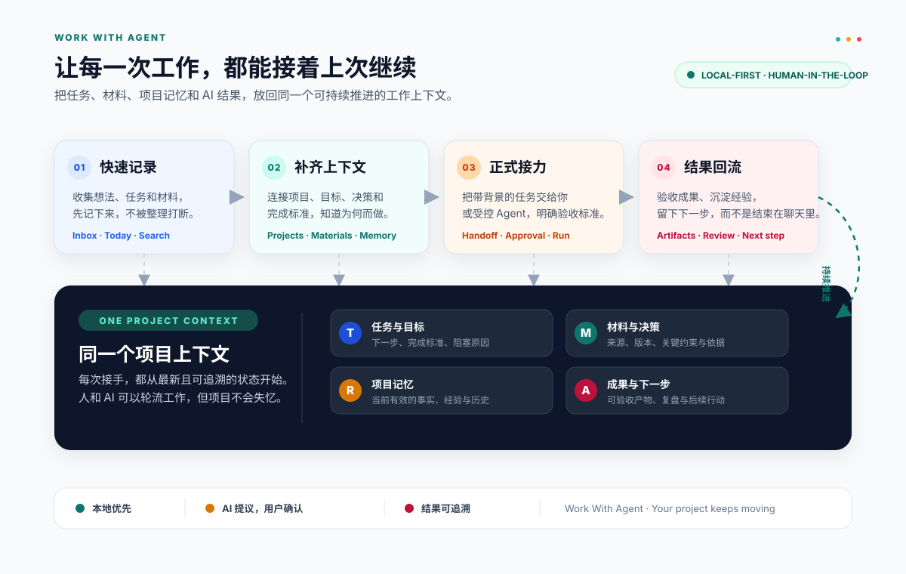

# Agent Studio


> 一个面向个人与团队工作流的 AI Agent 工作台：在对话中规划任务、管理执行，并对高风险操作进行人工审批。
>
> An AI agent workspace for planning and managing work through conversation, with human approval for sensitive actions.

[中文](#中文) · [English](#english)



## 中文

### 项目简介

Agent Studio 将 AI 对话和可视化工作区结合起来。你可以让 Agent 创建和整理主题、任务，生成摘要，执行受控的文件、Shell 或 HTTP 操作，并在操作前进行审批；所有关键变更都会留下可审计记录。

### 核心能力

- **流式 Agent 对话**：通过 Server-Sent Events 实时查看回复、工具调用和执行结果。
- **工作区看板**：以主题、任务和状态组织日常工作。
- **人工审批**：高风险工具调用进入待审批列表，可批准或拒绝。
- **变更审计与撤销**：记录用户和 Agent 的变更来源；对支持的操作提供安全撤销。
- **受控执行**：文件、Shell、HTTP 执行具备参数校验、超时、输出限制和敏感信息脱敏。
- **模型配置**：在设置页配置 OpenAI 兼容的接口地址、API Key 和模型名称。
- **响应式界面**：支持桌面和移动端，并提供亮色/暗色主题。

### 技术栈

| 层 | 技术 |
| --- | --- |
| 前端 | React 19、Vite、TypeScript、Tailwind CSS、TanStack Query |
| 服务端 | Node.js、Express 5、TypeScript、Zod |
| 数据层 | Prisma、SQLite |
| 测试 | Vitest、Supertest、Playwright |

### 快速开始

**环境要求**：Node.js 20+、npm 10+。

```bash
git clone https://github.com/your-org/agent-studio.git
cd agent-studio
npm install
npm run prisma:generate
npm run db:migrate
copy .env.example server\.env   # macOS/Linux: cp .env.example server/.env
npm run dev
```

启动后访问：

- Web：<http://localhost:5173>
- API：<http://localhost:3001>

在应用的“设置”页面填写模型配置。也可以通过环境变量设置 `PORT`，并在前端通过 `VITE_API_URL` 指定 API 地址。

### 常用命令

```bash
npm run dev       # 同时启动前后端开发服务
npm run build     # 构建服务端和客户端
npm test          # 运行单元与集成测试
npm run e2e       # 使用 Mock 模型运行 Playwright 验收测试
npm run test:all  # 单元/集成测试 + E2E
```

修改 `server/prisma/schema.prisma` 后，请先停止开发服务，再运行 `npm run prisma:generate` 和 `npm run db:migrate`。

### 安全说明

- API Key 仅由服务端保存和使用，界面只显示掩码值。
- Agent 发起的敏感变更需要审批后才会执行。
- 执行结果会脱敏，并记录来源、审批 ID 和请求 ID。
- 生产环境请使用 HTTPS、限制 CORS 来源，并通过安全的密钥管理系统注入配置。

### 项目结构

```text
client/       React 前端
server/       Express API、Agent、Prisma 数据层
e2e/          Playwright 端到端测试
docs/         架构与工程文档
architecture.svg
```

### 参与贡献

欢迎提交 Issue 和 Pull Request。提交前请运行 `npm run test:all`，并在 PR 中说明行为变化及测试覆盖。

## English

### Overview

Agent Studio combines AI conversation with a visual workspace for everyday work. Ask the agent to create and organize topics and tasks, generate summaries, or run controlled file, shell, and HTTP operations. Sensitive actions are paused for human approval, and important changes are recorded for auditability.

### Features

- **Streaming agent chat** with Server-Sent Events for messages, tool calls, and results.
- **Workspace board** for organizing topics, tasks, and statuses.
- **Human approval** for sensitive tool calls before execution.
- **Change audit and undo** for supported reversible mutations.
- **Controlled execution** with validation, timeouts, output limits, and secret redaction.
- **Model settings** for OpenAI-compatible base URLs, API keys, and model names.
- **Responsive UI** with light and dark themes.

### Tech stack

React 19, Vite, TypeScript, Tailwind CSS, TanStack Query, Node.js, Express 5, Zod, Prisma, SQLite, Vitest, Supertest, and Playwright.

### Quick start

**Requirements**: Node.js 20+ and npm 10+.

```bash
git clone https://github.com/your-org/agent-studio.git
cd agent-studio
npm install
npm run prisma:generate
npm run db:migrate
cp .env.example server/.env
npm run dev
```

Open <http://localhost:5173> for the web app. The API runs on <http://localhost:3001>. Configure the model from the Settings page, or set `VITE_API_URL` for a separate API host.

### Commands

```bash
npm run dev       # Start client and server together
npm run build     # Build client and server
npm test          # Unit and integration tests
npm run e2e       # Playwright acceptance tests with a mock model
npm run test:all  # Full test suite
```

### Security

API keys are stored and used by the server and displayed only in masked form. Agent-initiated sensitive mutations require approval. Execution output is redacted and linked to audit metadata. For production, use HTTPS, restrict CORS origins, and inject secrets through a dedicated secret manager.

### Contributing

Issues and pull requests are welcome. Run `npm run test:all` before submitting a PR and describe any behavior changes and relevant test coverage.

## License

Licensed under the [Apache License 2.0](./LICENSE).
